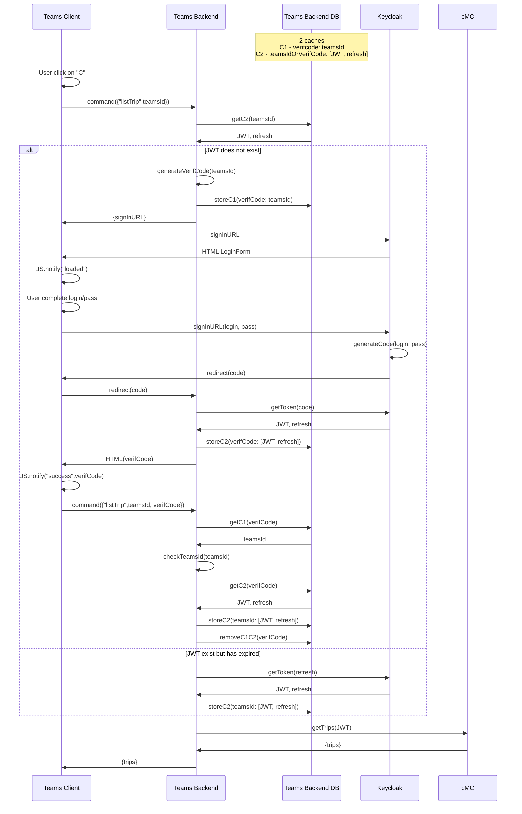

```mermaid
sequenceDiagram
  participant client as  Teams Client
  participant backend as  Teams Backend
  participant db as  Teams Backend DB
  participant kc as Keycloak
  participant cmc as cMC

  note over db:2 caches<br/>C1 - verifcode: teamsId<br/>C2 - teamsIdOrVerifCode: [JWT, refresh]
  client->>client: User click on "C"
  client->>backend: command({"listTrip",teamsId})
  backend->>db: getC2(teamsId)
  db->>backend: JWT, refresh

alt JWT does not exist
  backend->>backend: generateVerifCode(teamsId)
  backend->>db: storeC1(verifCode: teamsId)
  backend->>client: {signInURL}
  client->>kc: signInURL
  kc->>client: HTML LoginForm
  client->>client: JS.notify("loaded")
  client->>client: User complete login/pass
  client->>kc: signInURL(login, pass)
  kc->>kc: generateCode(login, pass)
  kc->>client: redirect(code)
  client->>backend: redirect(code)
  backend->>kc: getToken(code)
  kc ->>backend: JWT, refresh
  backend->>db: storeC2(verifCode: [JWT, refresh])
  backend->>client: HTML(verifCode)
  client->>client: JS.notify("success",verifCode)
  client->>backend: command({"listTrip",teamsId, verifCode})
  backend->>db: getC1(verifCode)
  db->>backend: teamsId
  backend->>backend: checkTeamsId(teamsId)
  backend->>db: getC2(verifCode)
  db->>backend: JWT, refresh
  backend->>db: storeC2(teamsId: [JWT, refresh])
  backend->>db: removeC1C2(verifCode)
  else JWT exist but has expired
  backend->>kc : getToken(refresh)
  kc ->>backend: JWT, refresh
  backend->>db: storeC2(teamsId: [JWT, refresh])
  end

  backend ->>cmc: getTrips(JWT)
  cmc->>backend : {trips}
  backend ->>client : {trips}         
```