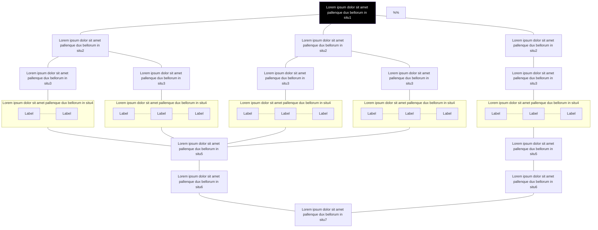

Lorem ipsum dolor sit amet, *consectetur* adipisicing elit, sed do eiusmod
tempor incididunt ut **labore et dolore magna aliqua**. Ut enim ad minim veniam,
quis nostrud exercitation ullamco laboris nisi ut aliquip ex ea commodo
consequat. ***Duis aute irure dolor*** in reprehenderit in voluptate velit esse
cillum dolore eu fugiat nulla pariatur. ~~Excepteur sint occaecat~~ cupidatat non
proident, sunt in culpa qui officia deserunt mollit anim id est laborum.

## H2

Lorem ipsum dolor sit amet, *consectetur* adipisicing elit, sed do eiusmod
tempor incididunt ut **labore et dolore magna aliqua**. Ut enim ad minim veniam,
quis nostrud exercitation ullamco laboris nisi ut aliquip ex ea commodo
consequat. 

---

***Duis aute irure dolor*** in reprehenderit in voluptate velit esse
cillum dolore eu fugiat nulla pariatur. ~~Excepteur sint occaecat~~ cupidatat non
proident, sunt in culpa qui officia deserunt mollit anim id est laborum.

### H3

#### Header4

Table Header-1 | Table Header-2 | Table Header-3
:--- | :---: | ---:
Table Data-1 | Table Data-2 | Table Data-3
TD-4 | Td-5 | TD-6
Table Data-7 | Table Data-8 | Table Data-9

##### Header5

You may also want some images right in here like  - you can do that but I would recommend you to use the component "image" and simply split your text.